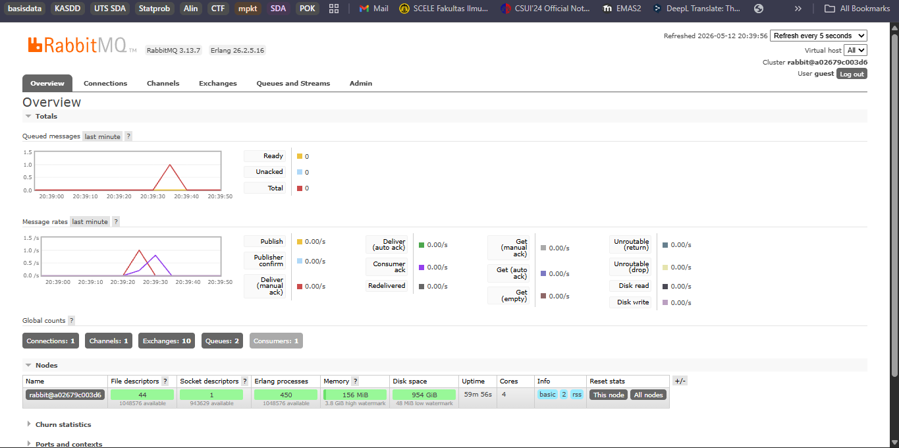

## Subscriber Reflection
a. What is amqp?
Protokol standar terbuka yang berfungsi untuk pengiriman pesan antar aplikasi (message-oriented middleware). Protokol ini digunakan aplikasi untuk saling mengirim data tanpa harus terhubung secara langsung atau aktif di waktu yang sama.
b. What does it mean? guest:guest@localhost:5672 , what is the first guest, and what is the second guest, and what is localhost:5672 is for?
    1. guest (pertama): username, akun bawaan yang otomatis dibuat saat kita menginstall sistem pengirim pesan di lokal komputer.
    2. guest (kedua): password. Secara umum, akun "guest" passwordnya juga "guest".
    3. Localhost: Hostname atau alamat server. Localhost disini layanan yang berjalan di komputer yang sama dengan aplikasi.
    4. 5672: port.

### Simulation slow subscriber

Gambar tersebut menunjukkan sistem antrean RabbitMQ yang sedang berjalan stabil, di mana pesan-pesan dari publisher  diproses oleh satu subscriber yang aktif hingga jumlah pesan di queue kembali ke angka nol. Jumlah queue ada sebanya 2 dan ini mencerminkan konfigurasi spesifik dari skrip yang telah dibuat lokal. Selain itu, menunjukkan bahwa sistem hanya menjalankan infrastruktur yang diperlukan untuk beban kerja saat ini.